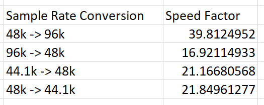

# Non-Integer Sample Rate Conversion

This repository contains a comparison of sample-rate
conversion (SRC) algorithms, with an emphasis on performance
for non-integer SRC factors. Currently two oversampling
algorithms are implemented:

- libsamplerate (Sinc interpolation, using `SRC_SINC_FASTEST` mode)
- Holters-Parker Resampler (using 4th-order Butterworth filters)
- Lanczos Resampler (borrowed from the [Surge Synthesizer](https://github.com/surge-synthesizer/surge) project)

## Results:
On my Linux machine, the HP resampler is faster than libsamplerate
by the following amounts:



## Building
```bash
$ cmake -Bbuild
$ cmake --build build --config Release
```
Then to run the testing tool, run
`./build/src_test`.

## Credits

- [libsamplerate](https://github.com/libsndfile/libsamplerate)
- The Holters-Parker Resampler is based on the filters derived in their [2018 DAFx paper](https://www.dafx.de/paper-archive/2018/papers/DAFx2018_paper_12.pdf)
- [matplotlibcpp](https://github.com/lava/matplotlib-cpp)
- The HP-Resampler, and Lanczos Resampler use a ton of code borrowed from the [Surge Synthesizer project](https://github.com/surge-synthesizer/surge) (in particular, the `SSEComplex` and `LanczosResampler` classes written by Paul Walker)

## License

The code in this repository is licensed under the GPLv3. Enjoy!
