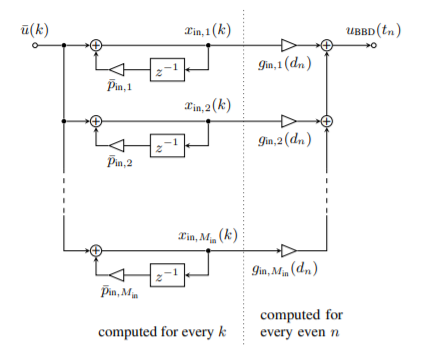

# Faster Non-Integer Sample Rate Conversion

A couple months ago, I was doing some research into emulating
[bucket-brigade devices](https://en.wikipedia.org/wiki/Bucket-brigade_device) for creating analog-style
delay-lines, when I ran into a rather interesting paper,
written by [Martin Holters and Julian Parker](http://dafx2018.web.ua.pt/papers/DAFx2018_paper_12.pdf).

Although bucket-brigade devices (BBDs) are made up of analog
circuits, in concept they behave like a fixed-length digital
delay-line with a variable sample rate which determines the
length of the delay created by the device. One of the primary
challenges of emulating BBDs is performing fast sample rate
conversion (SRC) to match the effective sample rate of the BBD.

Holters and Parker found a rather brilliant solution to this
problem. They noted that BBDs typically use filters at their
input and output, to reduce imaging and aliasing artifacts,
and figured out how to implement these filters in the digital
domain as "multi-rate" filters, so that the filter can use the
audio sample rate on one side of the filter, and the BBD sample
rate on the other side.

While I was eventually able to implement a BBD emulation using
Holters and Parker's method, I came to realize that their
algorithm can be used much more generally for any task that
requires sample rate conversion. (If anyone is interested in
the results of the BBD emulation, it is now impemented in
the [Surge Synthesizer](https://surge-synthesizer.github.io)
as part of their "Ensemble" effect.)

## Non-Integer Sample Rate Conversion

There are two fundamental kinds of sample rate conversions:
Integer Sample Rate Conversion and Non-Integer Sample Rate
Conversion.

With Integer SRC, the sample rate is being changed by an integer
factor. In this case, the block of audio can simply be truncated
or padded with zeros, and then filtered, again to avoid any
imaging or aliasing artifacts in the reconstructed signal.

It is possible to use two stages of Integer SRC to perform
Non-Integer SRC. For example, to upsample a signal by a factor
of 1.5, one option would be to upsample by a factor of 3,
and then downsample by a factor of 2. However, this approach
can become very costly in cases where a very large upsampling
factor is required.

A better option that works well for a broad range of SRC
factors is to use interpolation, for example
[Sinc interpolation](https://ccrma.stanford.edu/~jos/Interpolation/Ideal_Bandlimited_Sinc_Interpolation.html), or
[Lanczos interpolation](https://en.wikipedia.org/wiki/Lanczos_resampling).
One of the most commonly used sample rate conversion libraries,
[`libsamplerate`](https://github.com/libsndfile/libsamplerate)
(AKA "Secret Rabbit Code") uses Sinc interpolation, with a couple
different options, to trade off quality for performance.

Non-Integer sample rate conversion is a very common issue
in audio signal processing. For example, two commonly used
audio sample rates are 44.1 kHz and 48 kHz, which differ by
a factor 0f 1.088. If an algorithm is designed to run at one
sample rate, but a user wants to use the algorithm at a different
sample rate, then real-time non-integer SRC is often required.
In these cases, we want to be able to do the SRC as quickly as
possible, so that the majority of the time spent in our
processing code can be spent actually doing the signal
processing that we're interested in, rather than getting
to and from our target sample rate.

## Holters-Parker Resampling

Here I'd like to introduce Holters-Parker resampling as a
potential alternative to interpolation-based resampling.
Holters and Parker start with a filter in the analog domain,
to be used for anti-aliasing or anti-imaging similar to the
filters used in integer sample rate conversion. Next, Holters
and Parker mention the "impulse invariance" method for
discretizing analog filters. The idea behind impulse invariance
is to derive an expression for the impulse response of the
analog system, and then essentially "sample" the impulse
response at the sample rate of the digital system.

However, Holters and Parker instead use what they refer to
as a "modified impulse-invariant transform", so that the
input and output signals for the transformed filters may be
at different sample rates. When seen in the context of
sample rate conversion, this is a pretty neat insight:
rather than resampling and then filtering, the filtering and
resampling happen in the same process!

I won't delve too deeply into the implementation of the
Holters-Parker resampler here, except to note that while
it can be used with any choice of filters, I would
recommend choosing a filter order that is a multiple
of four. The reason for this is that my implementation
uses SIMD registers for computing the filter stages in
parallel. For CPUs with the SSE instruction set (most CPUs
these days), a single SIMD register can contain 4 32-bit
floating point numbers, enabling us to  compute a fourth-order
filter for the same computational cost as a first-order
filter. In my implementation, I use a fourth-order Butterworth
filter, but it should be possible to produce a higher-quality
output using a filter with a steeper rolloff, or with a
higher-order filter.

## Results
Finally, let's see how the Holters-Parker resampler compares
to the commonly used Sinc interpolation algorithm in
`libsamplerate`. Since I'm primarily interested in
speed rather than quality, I've set `libsamplerate` to
use the `SRC_SINC_FASTEST` option. As it turns out, the
results are not even close! On my Linux system running an
Intel i7 CPU, the Holters-Parker resampler measures 10-40x
faster than `libsamplerate` depending on the sample rate
conversion factor! On a Mac machine, I found comparable
results, while on my Windows machine, the improvements
were even more significant, nearing 40x in almost every
test case. Further, I don't think my implementation of
the Holters-Parker resampler is fully optimal just yet.
With a couple more rounds of optimisations, I bet
I could have it running even faster!

So does this mean that you should immediately abandon
`libsamplerate` and interpolation-based resampling
altogether? Certainly not! Sinc interpolation is
still the most ideal sample rate conversion scheme
in most cases, and `libsamplerate` has a thoroughly
tested implementation, with well understood trade-offs
between quality and speed. Further, there are other
interpolation-based methods that give decent quality
output and can also out-perform `libsamplerate`.

My goal here is simply to introduce the Holters-Parker
resampler as a potential option that may be useful for
some cases. Eventually, I'll need to see how my implementation
stacks up in both speed and quality to `libsamplerate`
and other interpolation-based SRC implementations. In
particular, I think choosing the right filter design
for the Holters-Parker resampler will be an important
part of getting the highest quality results.

## Conclusion
I hope this discussion of non-integer sample rate conversion
and Holters-Parker resampling has been interesting and useful!
If you'd like to take a look at the source code for my
implementation of the resampler, the code can be found on
[GitHub](https://github.com/jatinchowdhury18/NonIntegerSRC). I would greatly appreciate
any suggestions on how to improve the quality or performance
of the implementation!

Thanks to the Surge Synthesizer Team for piquing my interest
about all this stuff in the first place, and especially to
Paul Walker for showing me how to use SIMD to vectorize the
filter computations!
